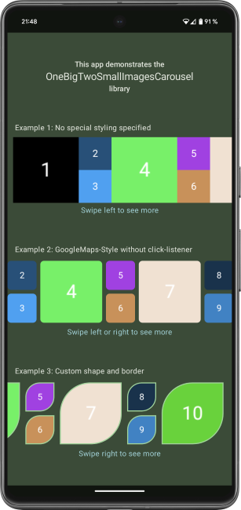

# OneBigTwoSmallImagesCarousel
[](https://jitpack.io/#VCDo/OneBigTwoSmallImagesCarousel)

**⚠️ Warning: This project is currently in an early stage of development and is not yet ready for
production use or as a stable library. ⚠️**

## Overview

**OneBigTwoSmallImagesCarousel** is an Android **Jetpack Compose** library that provides a
customizable image carousel that displays a horizontally scrollable carousel of images in a
"one big, two small" repeating pattern.

Ideal for photo galleries, product showcases, or any content with visual hierarchy.

## Features

*   Built with modern Android Jetpack Compose.
*   Displays images in an alternating "one large, two small" pattern.
*   Horizontally scrollable using Jetpack Compose's `LazyRow`.
*   Highly customizable item appearance via a flexible `Modifier`.
*   Callback for item click events.
*   Callback for changes in carousel scroll visibility (start, middle, end, all visible).

## Preview

Here some screenshots of the sample app:
<p align="center">
  
</p>

## Project Structure

This repository contains two modules:

- `library/` – The reusable Jetpack Compose-based carousel library
- `sample/` – A sample app demonstrating the usage of the library

## Getting Started

### Clone the Repository

```bash
git clone https://github.com/VCDo/OneBigTwoSmallImagesCarousel.git
cd OneBigTwoSmallImagesCarousel
```

### Open in Android Studio

Open the project in Android Studio (Giraffe or later) and let Gradle sync.

### Run the Sample App

Run the `sample` module on an emulator or physical device to see the carousel in action.

### Dependency

The library is available via [JitPack](https://jitpack.io).

```kotlin
dependencies {
    implementation("com.github.VCDo:OneBigTwoSmallImagesCarousel:<latest-version>")
}
```

## Library Documentation

For integration instructions, usage examples, and API details, see the [Library README](library/README.md).

## Contributing

Contributions are welcome!  
Please open an issue or submit a pull request.

## License

This project is licensed under the MIT License. See the [LICENSE](LICENSE) file for details.
