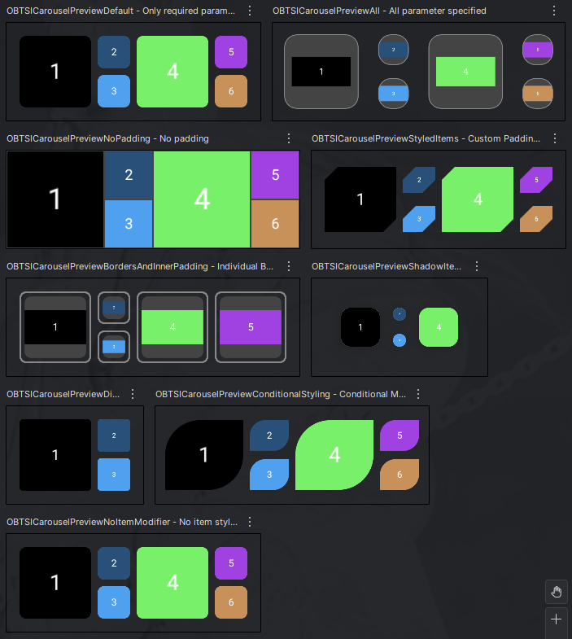

# OneBigTwoSmallImagesCarousel
[](https://jitpack.io/#VCDo/OneBigTwoSmallImagesCarousel)

**⚠️ Warning: This project is currently in an early stage of development and is not yet ready for
production use or as a stable library. ⚠️**

## Overview

**OneBigTwoSmallImagesCarousel** is an Android **Jetpack Compose** library that provides a
customizable image carousel that displays a horizontally scrollable carousel of images in a
"one big, two small" repeating pattern.

## Features

*   Displays images in an alternating "one large, two small" pattern.
*   Horizontally scrollable using Jetpack Compose's `LazyRow`.
*   Highly customizable item appearance via a flexible `Modifier`.
*   Callback for item click events.
*   Callback for changes in carousel scroll visibility (start, middle, end, all visible).
*   Built with modern Android Jetpack Compose.

## Preview

Here some previews:
<p align="center">
  
</p>

## Installation

The library is available via [JitPack](https://jitpack.io).

### Step 1 – Add JitPack to your root `settings.gradle`

```kotlin
dependencyResolutionManagement {
    repositoriesMode.set(RepositoriesMode.FAIL_ON_PROJECT_REPOS)
    repositories {
        google()
        mavenCentral()
        maven { url = uri("https://jitpack.io") }
    }
}
```
### Step 2 – Add the dependency to your module's `build.gradle.kts`:
```kotlin
dependencies {
    implementation("com.github.VCDo:OneBigTwoSmallImagesCarousel:<latest-version>")
}
```

Replace `<latest-version>` with the latest release tag (e.g., `1.0.0`).
(You will then find the current releases on the [Releases page](https://github.com/VCDo/OneBigTwoSmallImagesCarousel/releases) of this repository.)

For local testing, you can include the `:library` module directly as a project dependency in your
sample app: `implementation(project(":library"))`.

## Usage

Here's a basic example of how to use `OBTSICarousel` in your Composable function. First, make sure
you have a list of `Bitmap` objects ready.
```kotlin
import android.graphics.Bitmap
import androidx.compose.foundation.BorderStroke
import androidx.compose.foundation.background
import androidx.compose.foundation.border
import androidx.compose.foundation.layout.Arrangement
import androidx.compose.foundation.layout.PaddingValues
import androidx.compose.foundation.layout.fillMaxWidth
import androidx.compose.foundation.layout.height
import androidx.compose.foundation.layout.padding
import androidx.compose.foundation.shape.RoundedCornerShape
import androidx.compose.material3.MaterialTheme
import androidx.compose.runtime.Composable
import androidx.compose.runtime.remember
import androidx.compose.ui.Modifier
import androidx.compose.ui.draw.clip
import androidx.compose.ui.graphics.Color
import androidx.compose.ui.layout.ContentScale
import androidx.compose.ui.unit.dp

// Import OBTSICarousel
import de.darkovukic.android.onebigtwosmallimagescarousel.OBTSICarousel
import de.darkovukic.android.onebigtwosmallimagescarousel.OBTSICarouselVisibility
// Import BitmapHelpers for generating sample Bitmaps
import de.darkovukic.android.onebigtwosmallimagescarousel.util.BitmapHelpers

@Composable
fun MyScreenWithCarousel() {
    // 1. Prepare your list of Bitmaps
    // In a real application, you would load these from your ViewModel,
    // local storage, network, etc.
    val imageBitmaps: List<Bitmap> = remember {
        // Example with 9 images
        List(9) {
            BitmapHelpers.generateSampleBitmap(width = 200, height = 100, index = it)
        }
    }

    if (imageBitmaps.isEmpty()) {
        // Handle empty state if necessary
        // Text("No images to display.")
        return
    }

    // 2. Use the OBTSICarousel Composable
    OBTSICarousel(
        // >>> Required:

        // Set the height, width and background of the carousel
        modifier = Modifier
            .height(height = 300.dp)
            .fillMaxWidth()
            .background(color = MaterialTheme.colorScheme.secondary.copy(alpha = 0.2f)),

        // The list of images to display
        images = imageBitmaps,

        // Lambda for handling image content descriptions
        imageContentDescription = { index, image -> "Image $index" },

        // >>> Optional Styling:

        // Padding around the content
        contentPadding = PaddingValues(horizontal = 32.dp, vertical = 8.dp),

        // Padding, clip, border and background of each item
        itemModifier = Modifier
            .padding(
                vertical = 4.dp,
                horizontal = 8.dp
            )
            .clip(
                shape = RoundedCornerShape(topStartPercent = 50, bottomEndPercent = 50)
            )
            .border(
                border = BorderStroke(2.dp, MaterialTheme.colorScheme.primary),
                shape = RoundedCornerShape(topStartPercent = 50, bottomEndPercent = 50)
            )
            .background(
                color = Color.Blue.copy(alpha = 0.2f)
            ),

        // The arrangement of the items in the carousel
        itemArrangement = Arrangement.Start,

        // Content scale of item images
        itemContentScale = ContentScale.Crop,

        // >>> Optional Callbacks:

        // Callback when the visibility of the carousel changes
        onScrollVisibilityChanged = { state ->
            when (state) {
                OBTSICarouselVisibility.START_VISIBLE -> { /* Carousel start visible */ }
                OBTSICarouselVisibility.MIDDLE_VISIBLE -> { /* Carousel middle visible */ }
                OBTSICarouselVisibility.END_VISIBLE -> { /* Carousel end visible */ }
                OBTSICarouselVisibility.ALL_VISIBLE -> { /* Carousel completely visible/invisible */ }
            }
        },

        // Callback when an image is clicked
        onItemClick = {/* Handle item click */ },
    )
}
```

## Customization

The `OBTSICarousel` offers several parameters for customization:

### Core Parameters

*   `modifier`: `Modifier` - Applied to the main `LazyRow` container of the carousel.
*   `images`: `List<Bitmap>` - The list of bitmaps to display.
*   `imageContentDescription`: `(index: Int, bitmap: Bitmap) -> String?` - Provides content descriptions for accessibility.
*   `onItemClick`: `((index: Int) -> Unit)?` - Lambda invoked when an item is clicked.
*   `onScrollVisibilityChanged`: `(OBTSICarouselVisibility) -> Unit` - Lambda invoked when the scroll visibility state changes.

### Layout and Spacing

*   `contentPadding`: `PaddingValues` - Padding around the content of the `LazyRow`. Defaults to `PaddingValues(all = 12.dp)`.
*   `itemArrangement`: `Arrangement.Horizontal` - Horizontal arrangement of items within the `LazyRow` (e.g., spacing between chunks). Defaults to `Arrangement.spacedBy(0.dp)`.

### Item Appearance (Highly Flexible)

The appearance of each individual item (the big one or the two small ones) can be fully customized using the `itemModifier` parameter. This modifier is applied to the container of each image.

*   `itemContentScale`: `ContentScale` - Defines how the bitmap should be scaled within its bounds (e.g., `ContentScale.Crop`, `ContentScale.Fit`). Defaults to `ContentScale.Crop`.
*   `itemModifier`: `Modifier` - Allows you to apply any combination of modifiers to style each item. This is where you set padding, shape, background, borders, etc. for the items.
    *   **Note:** Essential layout modifiers (like `aspectRatio`, `fillMaxHeight`/`weight`, and `clickable`) are applied by the `OBTSICarousel` internally before your `itemModifier`. Your modifier is then applied via `.then()`, allowing you to further customize or even override certain aspects if needed.

### Scroll Visibility States

The `onScrollVisibilityChanged` callback provides a `OBTSICarouselVisibility` enum with the following states:

*   `START_VISIBLE`: The start of the carousel is fully visible, but the end is not.
*   `MIDDLE_VISIBLE`: Neither the start nor the end is fully visible (scrolling through the middle).
*   `END_VISIBLE`: The end of the carousel is fully visible, but the start is not.
*   `ALL_VISIBLE`: The entire carousel is fully visible, or the carousel is empty.

You can use these states to provide visual cues to the user (e.g., "swipe left to see more").

## License

This project is licensed under the MIT License. See the [LICENSE](LICENSE) file for details.
